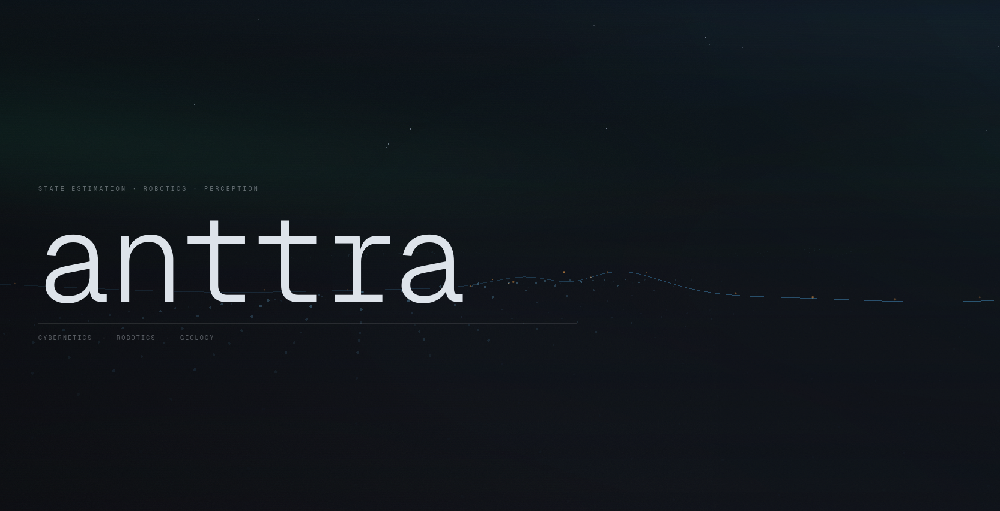

# Synapse
The main point of this project is to get insights of how to create websites and different libraries that can be used with react together with next.js. This is a chaotic collaboration between two students that pretty much has never created a website with the aim of incorporating backend usage before. It serves as a sandbox for building interactive web experiences and experimenting with frontend implementation

Demo: https://proj-synapse.vercel.app/

## Active pages
Currently, only Anttra page is active, as the main page and Michaelbcy is only scaffolding for future contributions
Demo: https://proj-synapse.vercel.app/anttra



## Main libraries used
* Framework: Next.js (React)
* Animation: GSAP
* 3D/Graphics: React Three
* FiberUI Components: Base-UI
* Computer Vision: OpenCV.js

This is a [Next.js](https://nextjs.org) project bootstrapped with [`create-next-app`](https://nextjs.org/docs/app/api-reference/cli/create-next-app).

## Getting Started

First, make sure you have Node.js (v20+ recommended) and npm installed.
```bash
# Install nvm
curl -o- https://raw.githubusercontent.com/nvm-sh/nvm/v0.39.7/install.sh | bash

# Reload your shell
source ~/.bashrc

# Install and use Node 20 (LTS)
nvm install 20
nvm use 20

# Verify
node -v

npm install
```

Run the development server:

```bash
npm run dev
# or
yarn dev
# or
pnpm dev
# or
bun dev
```

Open [http://localhost:3000](http://localhost:3000) with your browser to see the result.

This project uses [`next/font`](https://nextjs.org/docs/app/building-your-application/optimizing/fonts) to automatically optimize and load [Geist](https://vercel.com/font), a new font family for Vercel.

